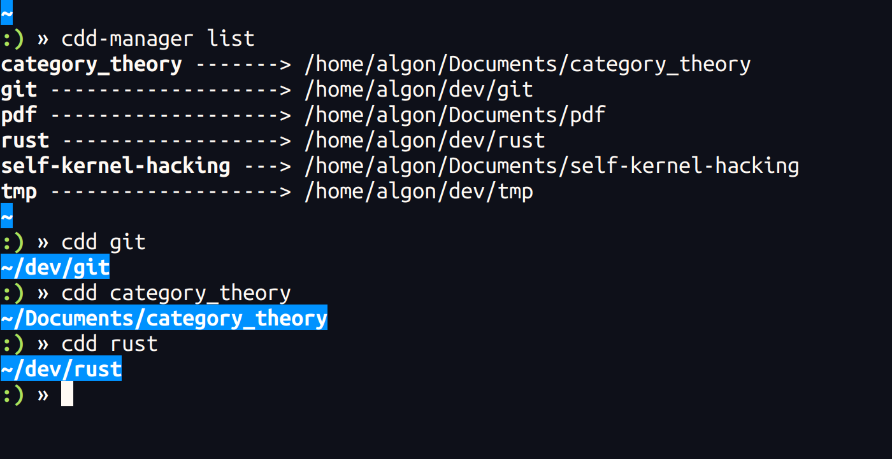

# cdd

> *Change Directory Directly*

This is a fork of  [algon-320/cdd-bash](https://github.com/algon-320/cdd-bash), which aims for zsh


## Demo




## Requirement

- zsh

## Installation

1. Copy `cdd` and `cdd-manager` somewhere (suppose they are in `path/to/scripts`).
2. Copy `_cdd` and `_cdd-manager` in fpath (suppose they are in `fpath`).


2. Add following lines to your `.zshrc`.
```sh
autoload -Uz path/to/scripts/cdd
autoload -Uz path/to/scripts/cdd-manager
autoload -Uz compinit
compinit -u
```

3. (OPTIONAL) Edit `CDD_DIR` in `cdd.sh`.
    - `$CDD_DIR` is used for registered symbolic links.
    - Its default value is `$HOME/.cdd`.
    - If the directory doesn't exist, it will be made automatically when the script is loaded.

## Usage

```
Usage:
    cdd-manager add <target-directory> [<link-name>]
    cdd-manager remove <link-name>
    cdd-manager list
```

### Register

##### using cdd-manager
```
$ cdd-manager add path/to/target/directory your_favorite_name
```
4th argument is optional (if it is omitted, basename of the directory is used)

##### manually
You can also register a directory manually.
(In fact, the above command is just creating a symbolic link to the target directory.)
```
$ ln -s /full/path/to/target/directory ${CDD_DIR}/your_favorite_name
```

### Jump
```
$ cdd your_favorite_name
```

### Remove
##### using cdd-manager
```
$ cdd-manager remove your_favorite_name...
```

##### manually
Just remove corresponding symbolic links.
```
$ rm ${CDD_DIR}/your_favorite_name
```

### Show list of the registered directories
```
$ cdd-manager list
your_favorite_name --> /full/path/to/target/directory

$ cdd [-l,--list]
your_favorite_name --> /full/path/to/target/directory 
```

